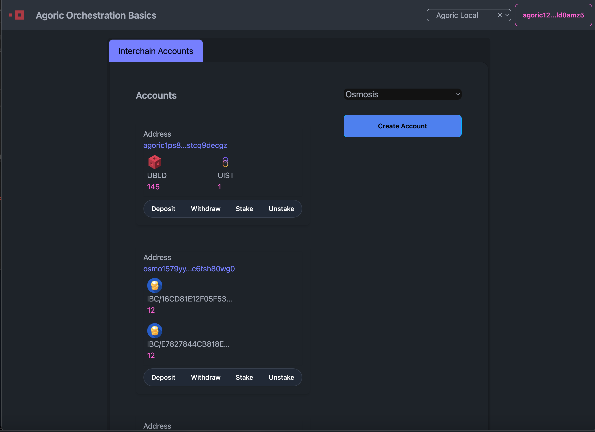

# Agoric Orchestration Basics Dapp


## Overview

The Orchestration Basics dApp showcases various features of the orchestration API running inside of an end-to-end environment, and a user interface:


## Set up the local environment

- Follow the instructions in `agoric-sdk/multichain-testing/README.md` to setup local multi-chain environment needed to run and test dApp. You can run `agd status` to check if this was successful.

- Run the following in the top level directory of `dapp-orchestration-basics` to run `hermes update` in the background:

```sh
make hermes-update & 
```

## Fund the account
- Run the following in the `contract/` directory of `dapp-orchestration-basics`:
```
make fund
```
This will fund `ADDR`, `CLIENTADDR`, and `CLIENT_OSMO_ADDR` as defined in `contract/Makefile`.

## Build & Deploy the dapp
- From the `contract/` directory of `dapp-orchestration-basics`, run:
```
make e2e
```
Wait for this step to complete (this could take a while!) before you start UI in the next.
## Start UI
- Run the following inside of the `ui/` directory of `dapp-orchestration-basics`:
```sh
yarn dev
```



--- 

# Tests
From top-level directory:
```
make test-orca
```

# tests from root directory
```
yarn cache clean; yarn; yarn workspace dapp-agoric-orca-contract test ; rm -rf -v yarn.lock package-lock.json node_modules contract/node_modules; yarn; yarn workspace dapp-agoric-orca-contract test
```

without clean:
```
yarn workspace dapp-agoric-orca-contract deploy
```

# deploy from root directory 
```
yarn cache clean; yarn; yarn workspace dapp-agoric-orca-contract test ; rm -rf -v yarn.lock package-lock.json node_modules contract/node_modules; yarn; yarn workspace dapp-agoric-orca contract:deploy
```

without clean:
```
yarn workspace dapp-agoric-orca-contract deploy
```

# e2e build/deploy
```
yarn workspace dapp-agoric-orca-contract deployc
```

# e2e environment using `multichain-testing`
using starship
```
make teardown ; make stop; make stop-forward; make clean; make; make port-forward
```

# e2e workspaces
```
yarn workspace dapp-agoric-orca-contract build; yarn workspace dapp-agoric-orca-contract e2e
```

# note
Troubleshooting remote calls

If an ordinary synchronous call (obj.method()) fails because the method doesn't exist, the obj may be remote, in which case E(obj).method() might work.

# ensure to override the chain registry (from inside multichain-testing):

```
yarn build (from agoric-sdk root)
make override-chain-registry
```

# funding on osmosis
```console
osmosisd tx bank send faucet osmo1dw3nep8yqy5szzxn6hmma6j2z77vp4wz8tkh0w3gyrruwny0w03s070kaa 299999999uosmo --chain-id osmosislocal --gas-adjustment 2 --gas auto --from faucet --gas-prices 0.0025uosmo
```

example rpc for balances:
```
http://127.0.0.1:26657/abci_query?path=%22/cosmos.bank.v1beta1.Query/AllBalances%22&data=%22%5Cn-agoric12j5kzvrwunqvrga5vm4zpy3mkeh3lvyld0amz5%22
```

# tmp fund ica
```console
agd tx bank send keplr1 agoric15ch7da0d8nvqc8hk6dguq4ext0lvskpjcwm3patf8sygm63chmpqjlzt74 1000uist -y --chain-id agoriclocal
```

# Interface
you can run `yarn dev` inside of the `ui` folder. 

