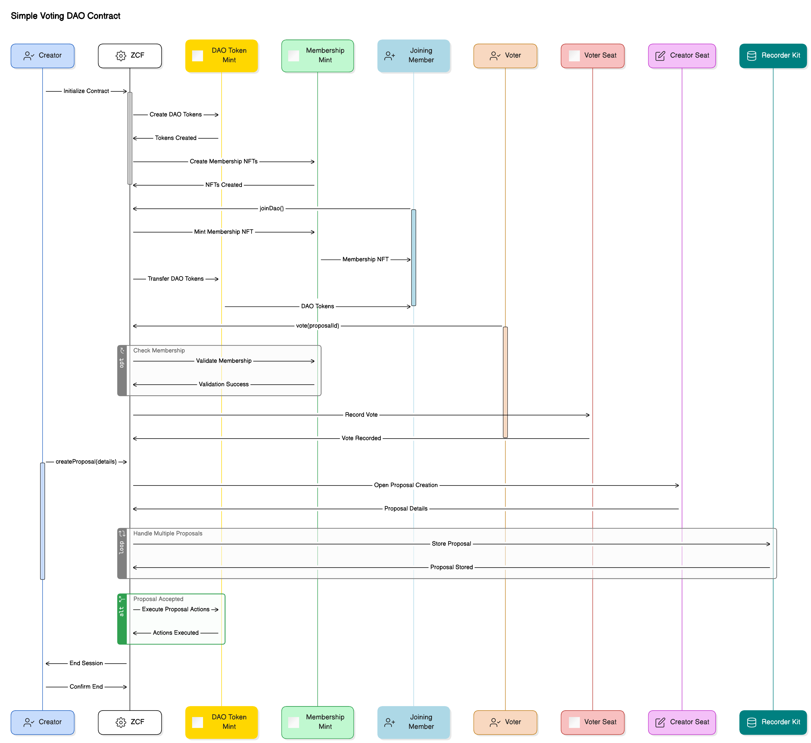

# Simple Voting DAO Contract on Agoric



## Overview

This simple voting DAO contract is designed to manage decentralized governance through proposals and voting. It utilizes ERTP (Electronic Rights Transfer Protocol) for handling and verifying digital assets within the smart contract.

## Features

- **Token Minting**: The contract mints its own DAO tokens and Membership NFTs which are used to manage membership and voting rights.
- **Proposal Management**: Members can create basic governance proposals which are then voted on by token holders.
- **Voting System**: Uses DAO tokens to cast votes on proposals. Members can vote 'for' or 'against' each proposal.

## Contract API

### Setup and Initial Minting

- Tokens (DAO and Membership) are minted when the contract starts.
- Initial tokens are allocated to the first seat (contract initiator).

Tokens (DAO and Membership) are minted when the contract starts. Initial tokens are allocated to the first seat (contract initiator):
```javascript
daoTokenMint.mintGains({DaoTokens: {brand: daoTokenBrand, value: initialDaoTokens}});
```

### Creating Proposals

- `createProposal(title, details)`: Creates a new proposal and returns a unique identifier for the proposal.
```javascript
const proposalId = createProposal('Example Proposal Title', 'Example Proposal Description');
```

### Joining the DAO

- `makeJoinInvitation()`: Returns an invitation that can be used to join the DAO. When used, it mints a new Membership NFT and allocates a specified amount of DAO tokens to the new member.

```javascript
const joinInvitation = makeJoinInvitation();
```

### Voting on Proposals

- `makeVoteInvitation()`: Returns an invitation to vote on a proposal.

```javascript
const voteInvitation = makeVoteInvitation();
```

- `vote(voterSeat, { proposalId, voteFor })`: Casts a vote for or against a proposal identified by `proposalId`. The voter must have a Membership NFT and enough DAO tokens to participate. The proposal's ID must be exist in the contracts state.

```javascript
vote(voterSeat, { proposalId: 1, voteFor: true });
```

## Technical Details

### Contract Code Structure

1. **Token Minting**: Separate mints for DAO tokens (fungible) and Membership NFTs (non-fungible).
2. **Proposal Handling**: Proposals are stored in a Map, with methods to create and retrieve proposals.
3. **Voting Mechanics**: Voting checks token holdings and updates proposal records with votes cast.

## Test Setup

Simple tests cover:

- Contract installation and setup.
- Joining the DAO.
- Creating a proposal.
- Voting on a proposal.

Each test checks on token balances and proposal outcomes after operations are executed.

### Running Tests

```bash
yarn install
yarn build
yarn test
```
